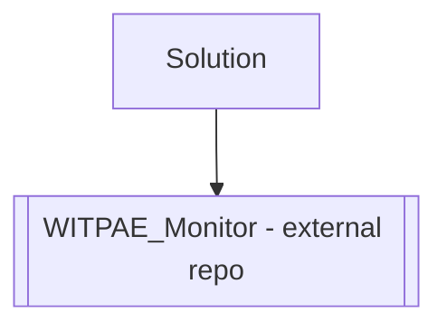

# WITPAE Tools
This "enterprise" is build around WITPAE.

## PI1

### Summary
- Added the initial portfolio for `PI1`.
- Portfolio repository: `WITPAE_Monitor`.

### Solution diagram (as it now looks)

## PI2

### Summary
- Initialized `PI2` release planning artifacts.
- Target release metadata set to `TBD` in `PI2/README.md`.
- Turn-boundary rule defined: `wpae002.pws` marks start of turn processing, and `wpae000.pws` marks end of turn processing (invoke extraction after stable-write checks).

### Solution diagram (as it now looks)

## Referenced repositories

| Repository name | Summary | README link |
| --- | --- | --- |
| WITPAE_Monitor | Command-line parser for War in the Pacific Admiral's Edition `.pws` scenario files that uses `pwsdll.dll` and emits structured JSON game/state entities for automation and integration workflows. | [README](https://github.com/drwilliamroney/WITPAE_Monitor/blob/main/README.md) |

